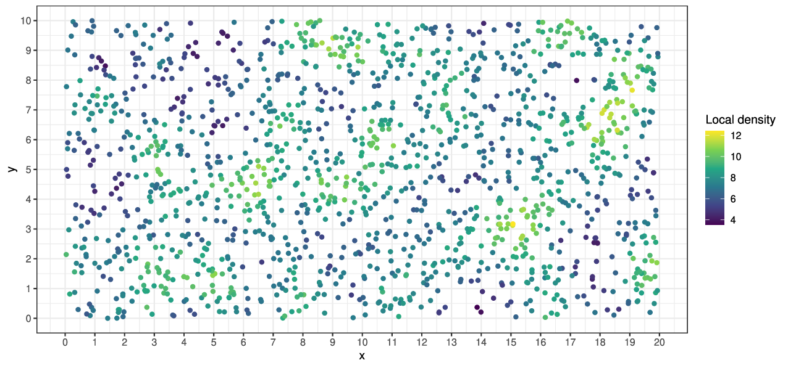
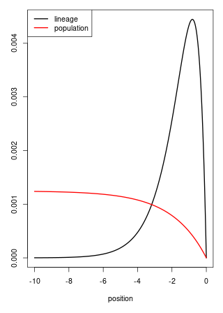

# Outline

<!--
title-slide-attributes:
    data-background-image: /path/to/title_image.png
    data-background-size: contain
-->

::: {.columns}
:::::: {.column}

**Joint work with:**

- Alison Etheridge (Oxford)
- Tom Kurtz (Madison)
- Ian Letter (ex-Oxford)
- Terence Tsui (Warwick)

:::
:::::: {.column width=50%}

:::
::::::

-----------

*slides:* [github.com/petrelharp/berkeley-oct-2024](https://petrelharp.github.io/berkeley-oct-2024/berkeley-oct-2024.slides.html)

--------------------

> UO is located on the traditional indigenous homeland of the Kalapuya people.
Kalapuya people were dispossessed of their indigenous homeland by the United States government and forcibly removed.
Today, Kalapuya descendants are primarily citizens of the Confederated Tribes of Grand Ronde and the Confederated Tribes of Siletz Indians,
and continue to make important contributions to their communities, to the UO, to Oregon, and to the world.

# Motivation

## Motivating question

> What can we deduce about the history of a population from
patterns of genetic variation that we observe today?

- genetic differences produced by mutations
- which accumulate slowly since common anestors

> What can we deduce about the history of a population from
the genealogies that we observe today?

... which are now *inferrable*.

## The world is not <s>flat</s> homogeneous {data-background-image="figs/east_bay.jpg" data-background-position=center}

::: r-stretch

:::

--------

::: {.columns}
:::::: {.column width=50%}

How we usually model it:

*"Over large spatial and temporal scales local details should wash out"*

:::
:::::: {.column width=50%}

:::: fragment
*... but will they?*

::::

:::
::::::

# A model

## A model, based on "interacting branching processes"

:::: {.columns}
:::::: {.column width=60%}

$$\eta(x) = \text{population at (or close to) } x$$

::: incremental 
- A juvenile is born *per capita rate $\gamma(x, \eta(x))$*
- Dispersal *distribution $q(x, dy)$ (Gaussian)*
- Establishment *probability $r(y, \eta(y))$*
- Death of mature individuals *rate $\mu(x, \eta(x))$*
:::

::: fragment
Can choose parameters to achieve stability.
:::

::::
:::::: {.column width=40%}

::: r-stack 

::::: fragment

:::::

::::: fragment

:::::

:::

::::
::::::

::: {.fragment .highlight-green}
*We only track mature individuals.*
:::

# A note of caution

::: {.floatright}
{width=40%}

::::: {.caption}
*Gilia Patterson*
:::::

:::

---------------------

::: {.columns}
:::::: {.column width=60%}

- death: $\mu = 0.3$ per generation

- establishment: $r = 0.7$

- dispersal: Gaussian with SD $\sigma$

- local density: in circle of radius $\epsilon$

- reproduction: with $K=2$, $\lambda=3$,
$$ \gamma = \frac{\lambda}{1 + \text{(local density)}/K} $$

- non-spatial equilibrium density:
$$ K \left( \frac{\lambda}{1 - r} - 1 \right) .$$

:::
:::::: {.column width=40%}

::: {.caption}
*SLiM code at [github.com/petrelharp/berkeley-oct-2024](https://github.com/petrelharp/berkeley-oct-2024/raw/main/gilia_clumping_sim.slim)*
:::

:::
::::::

## Large dispersal distance

-  dispersal distance $\sigma = 3$
-  interaction distance $\epsilon = 1$
-  mean # offspring $\propto (1 + \text{(density)} / K)^{-1}$

. . .

## Small dispersal distance

-  dispersal distance $\sigma = 0.2$
-  interaction distance $\epsilon = 1$
-  mean # offspring $\propto (1 + \text{(density)} / K)^{-1}$

. . .

Low dispersal distance copamred to distance over which negatively influenced by presence of neighbors
can lead to strong clumping - true even in deterministic model!

# Characterising the model

## Local density

Birth-death process with dynamics:

- A juvenile is born *per capita rate $\gamma(x, \eta(x))$*
- Dispersal *distribution $q(x, dy)$ (Gaussian)*
- Establishment *probability $r(y, \eta(y))$*
- Death of mature individuals *rate $\mu(x, \eta(x))$*

. . .

::: red
Think of population as a point measure, with atoms of mass $1/N$,
and write
$$ \langle f, \eta \rangle = \frac{1}{N} \sum f(X_i) = \int f(x) \eta(dx) . $$
:::

. . .

::: blue
Rates depend on *local density near $x$*:
$$ \gamma(x, \eta(x)) := \gamma(x, \rho_\gamma * \eta(x));
\qquad \rho_\gamma * \eta(x) = \int \rho_\gamma(x-y) \eta(dy) .$$
:::

. . .

There are *three* interaction kernels, $\rho_r$, $\rho_\gamma$, and $\rho_\mu$,
which need not be the same.

## Scaling the model  -- parameters $N$, $\theta$

Birth-death process with dynamics:

- A juvenile is born per capita rate ${\color{red}\theta}\gamma(x, \eta(x))$
- Dispersal distribution $q_{\color{red}\theta}(x, dy)$ (Gaussian mean and variance order $1/\theta$)
- (Instantaneous) establishment probability $r(y, \eta(y))$
- Death of mature individuals rate $\mu_{\color{red}\theta}(x, \eta(x))$

. . .

Assume: 
$$\int \theta\left( r(z, \eta) f(z) - r(x,\eta)f(x) \right) q_\theta(x, dz)
\stackrel{\theta\to\infty}{\longrightarrow} \Delta\left(r(\cdot, \eta) f(\cdot)\right)(x) $$

. . . 

$$ \theta\left( r(z, \eta) \gamma(x, \eta) - \mu_\theta(x, \eta)\right) = F(x,\eta)$$

. . .

::: tiny
(Roughly, $r$ sufficiently smooth and net per capita growth rate $\propto 1/\theta$.)
:::

. . .

(See paper for more general case:
an operator instead of $\Delta$.)

## How do things change, locally? $\langle f, \eta \rangle = \frac{1}{N} f(X_i) = \int f(x) \eta(dx)$

- Individual at $x$ gives birth to a single mature offspring at $z$ at rate
$$ \theta \gamma(x, \eta) r(z, \eta) q_\theta(x,dz) \qquad \text{increment} \langle f,\eta \rangle \text{by} \frac{1}{N} f(z) .$$

- Individual at $x$ dies at rate 
$\theta\mu_\theta(x,\eta)$ increment $\langle f,\eta \rangle$ by $-\frac{1}{N} f(x)$

. . .

$$\begin{aligned}
\frac{d}{dt}\mathbb{E}\left[\langle f, \eta_t\rangle \big| \eta_0 = \eta\right] \big|_{t=0} 
\end{aligned}$$

::: r-stack

:::: {.fragment .coverup}
$$\begin{aligned}
&\qquad = \theta \int \int \color{red}{\frac{1}{N}} f(z) r(z, \eta) 
q_\theta(x, dz) \gamma(x, \eta) \color{red}{N} \eta(dx) 
\\ &\qquad \qquad \qquad 
- \theta \int \color{red}{\frac{1}{N}} f(x) \mu_\theta(x, \eta) \color{red}{N} \eta(dx) .
\end{aligned}$$
::::

:::: {.fragment .coverup}
$$\begin{aligned}
& = \theta \int \int f(z) r(z, \eta) q_\theta(x, dz)\gamma(x, \eta) \eta(dx)
- \theta \int f(x) \mu_\theta(x, \eta)\eta(dx) \\
&\vphantom{\int}
\end{aligned}$$
::::

:::: {.fragment .coverup}
$$\begin{aligned}
 &= \int \left( \int \theta(f(z) r(z, \eta) - f(x) r(x, \eta)) q_\theta(x,dz)\right) \gamma(x, \eta) \eta(dx) \\
 &\qquad \qquad {}+ \int \int f(x) \theta \left(r(x,\eta)\gamma(x, \eta) - \mu_\theta(x,\eta)\right) \eta(dx) .
\hspace{5em}
\end{aligned}$$

::: floatright
using $\int q_\theta(x,dz) = 1$
:::
::::

:::

:::: fragment
$$
\stackrel{\theta \to \infty}{\longrightarrow}
\int \gamma(x,\eta) \Delta(f(\cdot)r(\cdot,\eta))(x) \eta(dx)
+ \int f(x) F(x,\eta) \eta(dx)
$$
::::

## Quadratic variation

- Individual at $x$ gives birth to single mature offspring at $z$ at rate
    $\theta \gamma(x,\eta)r(z,\eta)q_\theta(x,dz)$:
    increment $\langle f, \eta \rangle = \frac{1}{N} f(z)$

- Individual at $x$ dies at rate
    $\theta \mu_\theta(x,\eta)$:
    increment $\langle f, \eta \rangle = -\frac{1}{N} f(x)$

$$\begin{aligned}
&N \theta \big\{ \big\langle \int \frac{1}{N^2} f^2(z) r(z,\eta) q_\theta(x,dz), \eta(dx) \big\rangle
\\&\qquad \qquad {} +
\big\langle \frac{1}{N^2} f^2(z) \mu_\theta(x,\eta), \eta(dx) \big\rangle \big\}
\\&= \frac{\theta}{N} \big\langle
\gamma(x,\eta) \int f^2(z) r(z,\eta) q_\theta(x,dz) + f^2(x) \mu_\theta(x,\eta), \eta(dx)
\big\rangle
\end{aligned}$$

::: {.fragment .red}
$$
\int f^2(z) r(z,\eta) q_\theta(x,dz) \to f^2(x) r(x,\eta),
\qquad
\mu_\theta = r\gamma - \frac{1}{\theta}F \to r \gamma
$$
:::

::: fragment
$\stackrel{\theta\to\infty}{\longrightarrow} \alpha \langle 2 r(x,\eta) \gamma(x,\eta) f^2(x), \eta(dx) \rangle$
where
$\alpha := \lim \frac{\theta}{N}$.
:::

## small / large $\alpha$:

{width=45%}
{width=45%}

## Martingale characterization of limit

$$\begin{aligned}
& \langle f(x), \eta_t(dx)\rangle - \langle f(x), \eta_0(dx)\rangle
\\&\qquad {} 
- \int_0^t \big\langle \gamma(x,\eta_s)\Delta\left(f(\cdot)r(\cdot,\eta_s)\right)(x) + F(x,\eta_s)f(x),
    \eta_s(dx) \big\rangle ds
\end{aligned}$$
is a martingale, $M_f(\cdot)$, with
$$ \langle M_f \rangle_t = \alpha \int_0^t \big \langle 2 r(x,\eta_s)\gamma(x,\eta_s) f^2(x), \eta_s(x) \big \rangle ds . $$

::: incremental
- $\alpha=0$: non-local PDE
- can also recover 'local' PDEs $$\partial_t \eta = r \Delta(\gamma \eta) + F\eta$$
- $\alpha > 0$: nonlinear superprocess
:::

. . .

e.g., $\gamma\equiv1$, $r\equiv1$, $F=1-h*\eta$, (diffusion limit of) Bolker-Pacala model: spatial branching process; reproductive success decreases in crowded regions.

## Assumptions

Assume

$$\int \theta(f(z) r(z, \eta) - f(x) r(x, \eta)) q_\theta(x,dz)
\stackrel{\theta \to \infty}{\longrightarrow}
\Delta(f(\cdot)r(\cdot,\eta))(x)$$

$$\theta\left(
r(x,\eta) \gamma(x,\eta) - \mu_\theta(x,\eta)
\right) = F(x,\eta)$$

. . .

- per capita birth rate of juveniles, $\gamma$, bounded above

- 'approximate excess growth rate', $F$, bounded above
    but not necessarily below (logistic growth)

- instead of $\Delta$ can have any uniformly elliptic second order differential operator

## Remarks

::: incremental
- Classical models emerge as special cases of the scaling limits
    * Fisher-KPP and Allen-Cahn equations;
        Bolker-Pacala model;
        spatial branching processes
    
- The two stages of reproduction can result in a nonlinear diffusion
    *even in the scaling limit*

- Information about population history recovered from patterns of genetic variation.
    Using a lookdown construction, we retain information about genealogies
    in the scaling limit.

:::

# Ancestral lineages

::: blue
Consider a single ancestral lineage
$$L_t = (\text{location of the genetic ancestor time $t$ ago}).$$
:::

. . .

and for this talk, work in the classical PDE limit.

## Ancestral lineages

Suppose population has a stationary density $w(x)$. Then
$$ dL_t = r(L_t) \gamma(L_t) 2 \nabla \log(w\gamma)(L_t) dt
+ \sqrt{r(L_t)\gamma(L_t)} dB_t$$

. . .

- Lineage speed determined by rate of production of mature offspring ($r\gamma$), $\approx$ death,
- and drawn to regions of high total fecundity

. . .

Lineage motion *not* uniquely determined by population denisty:
$w$ solves
$$ r\Delta(\gamma w) + (r\gamma - \mu) w = 0, $$

. . .

multiply $r$ and $\mu$ by $\lambda$:
- same stationary density, but
- lineages spend more time where $\lambda < 1$: those areas have higher long-term fitness.

# Reaction-diffusion equations and range expansion ($d=1$)

## Fisher-KPP

$$ \frac{\partial u}{\partial t} = \frac{\partial^2 u}{\partial x^2} + u (1-u) $$

$\gamma \equiv 1$, $r \equiv 1$, $F(x,m) = 1 - m$.

. . .

Traveling wave solution $\varphi(t,x) = w(x - 2t)$,
so lineage moves relative to the wave front as
$$\begin{aligned}
dL_t 
&= 2 \nabla \log(w)(L_t) dt + 2 dt + dB_t
\end{aligned}$$

. . .

$w(x) \sim e^{-x}$, so lineages stay in the wave front
(where numbers are small and the scaling limit breaks down)

## Allen-Cahn

$$ \frac{\partial u}{\partial t} = \frac{\partial^2 u}{\partial x^2} + u (1-u) \color{blue}{(2u - 1 + s)} 
\qquad \color{blue}{s \in (0, 2)}$$

Now $F(x,m) = (1 - m)(m - \rho)$, bistable.

. . .

Traveling wave solution $\varphi(t,x) = w(x - st)$
with $w(x) = (1 + e^x)^{-1}$,
so lineage moves relative to the wave front as
$$\begin{aligned}
dL_t 
&= \left(s - 2 \frac{e^{L_t}}{1 + e^{L_t}}\right) dt + dB_t ,
\end{aligned}$$

. . .

with stationary distribution $\propto e^{sx}(1 + e^x)^{-2}$.

## A less classical example $\gamma \propto$ pop density, logistic control

:::: r-stack

::: {.fragment .coverup}
$$ \frac{\partial u}{\partial t} = \frac{\partial^2}{\partial x^2} (u^2) + u (1-u) ,
\qquad
\phantom{u(t,x) = \left(1 - \exp\left(\frac{1}{2}(x-t)\right)\right)_+}
$$
:::

::: {.fragment .coverup}
$$ \frac{\partial u}{\partial t} = \frac{\partial^2}{\partial x^2} (u^2) + u (1-u) ,
\qquad
\color{blue}{u(t,x) = \left(1 - \exp\left(\frac{1}{2}(x-t)\right)\right)_+}
$$
:::

::::

"Effective" density dependent dispersal

. . .

::: columns

:::::: {.column width=50%}

::::::

:::::: {.column width=50%}
:::: incremental
- Ancestral lineage has stationary distribution
$\propto e^x (1 - e^{x/2})$ for $x < 0$
- With noise can expect quite different genealogy from F-KPP.
::::
::::::
:::

# Closing

## Remarks

- In spite of complexity, some mathematical tractability
- A trace of the two-step reproduction mechanisms persists over large temporal and spatial scales
- Readily simulated in [SLiM](https://messerlab.org/SLiM)
- Readily extended

## noodling

::: r-stack

:::: fragment
*Will they?*
::::

:::: fragment

::::

:::: fragment
$$\int_0^\infty e^{ix} dx$$
::::

:::

## {data-background-image="figs/guillemots_thanks.png" data-background-position=center data-background-size=50%}

------

